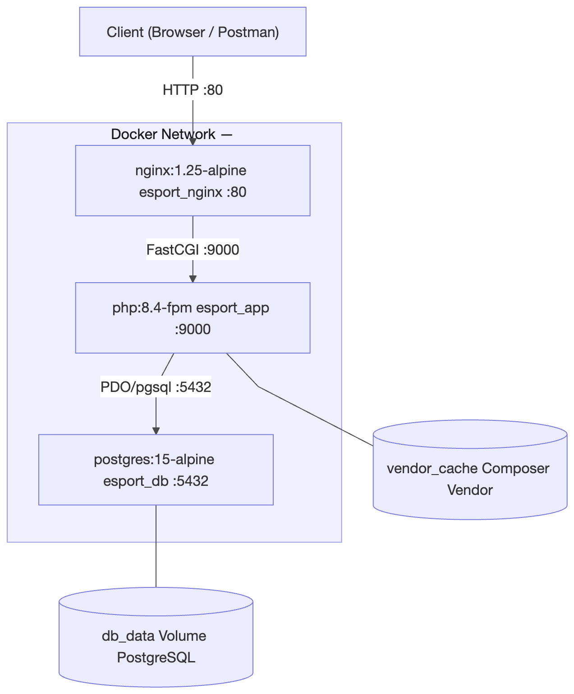
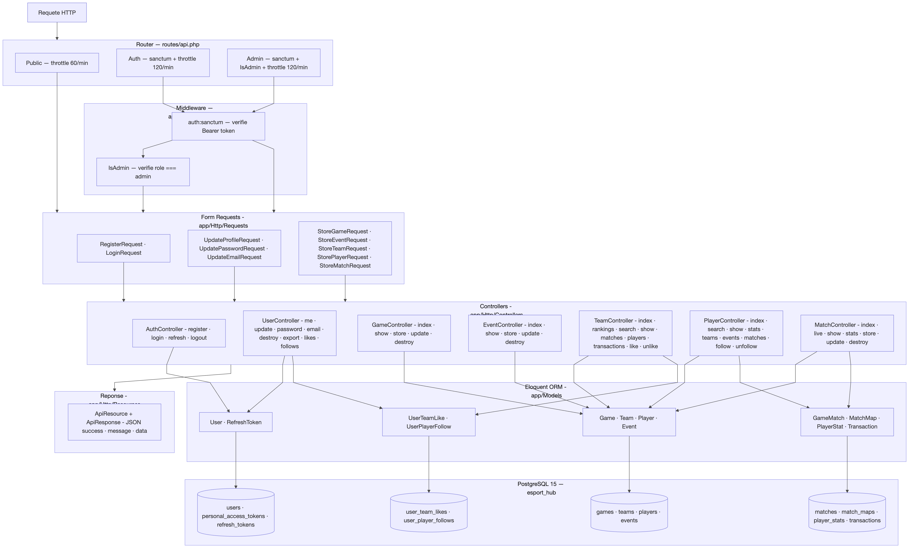
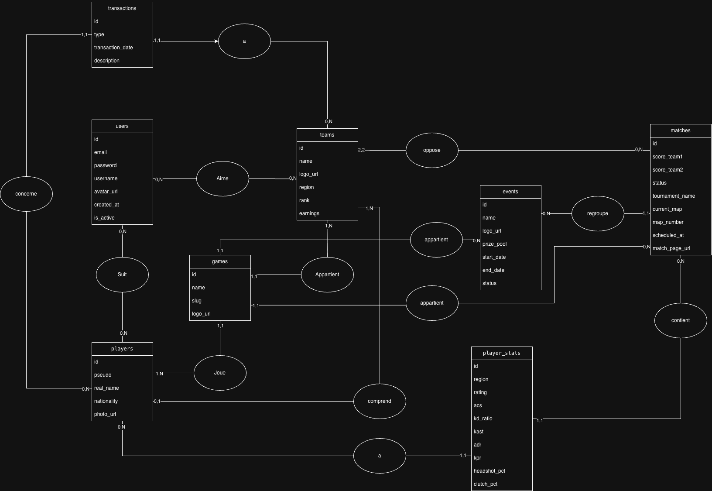
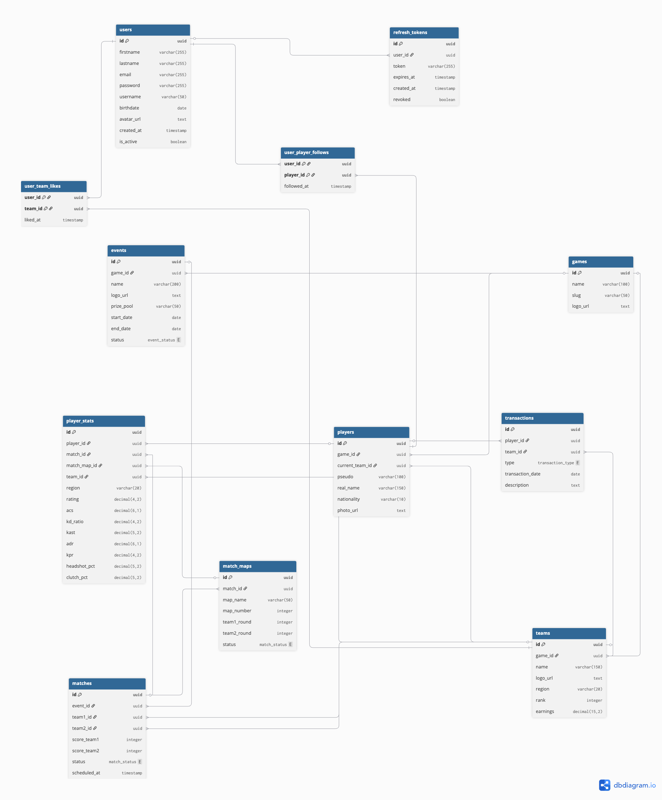
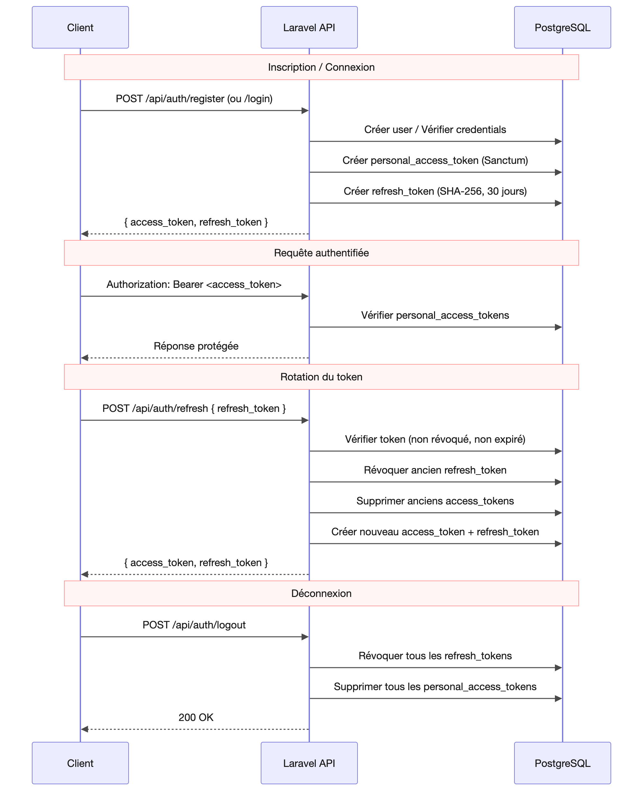
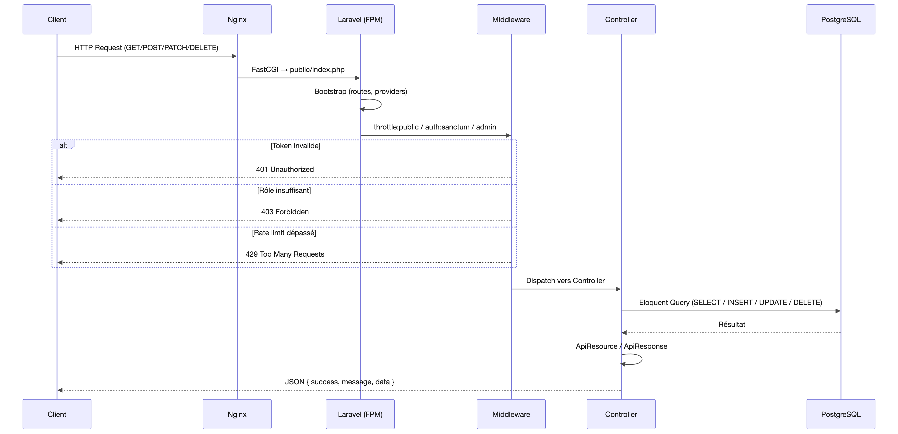

# Documentation Technique — EsportHub API

> API REST dédiée aux données esport FPS tactique (Valorant, CS2)  
> Laravel 12 · PostgreSQL 15 · Docker · JWT (Sanctum)

---

## Table des matières

1. [Présentation du projet](#1-présentation-du-projet)
2. [Cahier des charges](#2-cahier-des-charges)
3. [Architecture globale](#3-architecture-globale)
   - [Architecture Docker](#31-architecture-docker)
   - [Architecture Laravel (MVC)](#32-architecture-laravel-mvc)
4. [Modèle de données](#4-modèle-de-données)
   - [MCD](#41-mcd)
   - [MLD](#42-mld)
5. [Diagrammes de séquence](#5-diagrammes-de-séquence)
   - [Flux d'authentification](#51-flux-dauthentification)
   - [Flux d'une requête HTTP](#52-flux-dune-requête-http)
6. [Base de données](#6-base-de-données)
7. [API — Endpoints](#7-api--endpoints)
   - [Authentification](#71-authentification)
   - [Compte utilisateur](#72-compte-utilisateur)
   - [Jeux](#73-jeux)
   - [Événements](#74-événements)
   - [Équipes](#75-équipes)
   - [Matchs](#76-matchs)
   - [Joueurs](#77-joueurs)
   - [Administration](#78-administration)
8. [Modèles & Relations](#8-modèles--relations)
9. [Authentification & Sécurité](#9-authentification--sécurité)
10. [Infrastructure Docker](#10-infrastructure-docker)
11. [Tests](#11-tests)
12. [Structure du projet](#12-structure-du-projet)
13. [Variables d'environnement](#13-variables-denvironnement)
14. [Dépendances](#14-dépendances)
15. [Collection Postman](#15-collection-postman)

---

## 1. Présentation du projet

**EsportHub** est une API REST dédiée aux fans d'esport FPS tactique. Elle centralise les informations essentielles sur les compétitions professionnelles : équipes, joueurs, matchs en direct, classements et actualités.

### Périmètre

| | |
|---|---|
| **Inclus** | Exposition de données esport, gestion de compte utilisateur, likes/favoris, suivi live, classements, actualités, événements |
| **Exclu** | Streaming vidéo, paris, messagerie, gestion de tournois, contenu payant, jeux hors FPS tactique |
| **Format** | API REST, réponses JSON, authentification JWT |
| **Jeux ciblés** | Valorant (V1) — CS2, Rainbow Six Siege (V2+) |

### Stack technique

| Composant | Technologie |
|---|---|
| Backend | PHP 8.4, Laravel 12 |
| Base de données | PostgreSQL 15 |
| Authentification | Laravel Sanctum (double token) |
| Conteneurisation | Docker, Docker Compose |
| Serveur web | Nginx 1.25 |
| Tests | Pest PHP |

### Statistiques clés

| Métrique | Valeur |
|---|---|
| Routes API | 61 |
| Contrôleurs | 9 |
| Modèles | 12 |
| Tables DB | 16 |
| Migrations | 19 |
| Tests | 73 |
| Assertions | 190 |

---

## 2. Cahier des charges

Le cahier des charges complet est disponible dans le fichier PDF joint :

📄 **[le_blay_ianis_EsportHub.pdf](le_blay_ianis_EsportHub.pdf)**

Il couvre :
- Le contexte et périmètre du projet
- Les cibles et utilisateurs (développeur front-end, bot/intégration tierce)
- Les rôles utilisateurs (visiteur, utilisateur authentifié)
- La liste complète des fonctionnalités et endpoints
- Le MCD et le MLD

---

## 3. Architecture globale

### 3.1 Architecture Docker

L'application est entièrement conteneurisée avec Docker Compose. Trois services communiquent via un réseau interne `esport_network`.



**Services :**

| Service | Image | Port exposé | Rôle |
|---|---|---|---|
| `db` | postgres:15-alpine | 5432 | Base de données PostgreSQL |
| `app` | Custom (php:8.4-fpm) | 9000 (interne) | Application Laravel (PHP-FPM) |
| `nginx` | nginx:1.25-alpine | 80 | Reverse proxy / serveur web |

**Flux :**
```
Client HTTP
    ↓
nginx:80  (reverse proxy)
    ↓
app:9000  (PHP-FPM / Laravel)
    ↓
db:5432   (PostgreSQL)
```

**Démarrage automatique (entrypoint `app`) :**
1. `composer install`
2. `php artisan key:generate`
3. `php artisan migrate --force`
4. `php artisan db:seed --force`
5. `php-fpm`

### 3.2 Architecture Laravel (MVC)



Laravel suit le pattern **MVC** enrichi de couches supplémentaires :

```
Request HTTP
    ↓
routes/api.php          (routeur)
    ↓
Middleware              (auth:sanctum, IsAdmin, throttle)
    ↓
FormRequest             (validation des données entrantes)
    ↓
Controller              (logique métier)
    ↓
Model / Eloquent ORM    (accès base de données)
    ↓
ApiResource             (sérialisation JSON)
    ↓
ApiResponse             (format de réponse uniforme)
    ↓
Response JSON
```

**Format de réponse uniforme (`ApiResponse`) :**
```json
{
  "success": true,
  "message": "string",
  "data": {}
}
```

---

## 4. Modèle de données

### 4.1 MCD

Le Modèle Conceptuel de Données décrit les entités métier et leurs relations.



**Entités principales :**
- `users` — Comptes utilisateurs
- `games` — Jeux FPS tactiques supportés
- `teams` — Équipes professionnelles
- `players` — Joueurs professionnels
- `events` — Tournois et événements
- `matches` — Matchs entre équipes
- `match_maps` — Cartes jouées dans un match
- `player_stats` — Statistiques par joueur par map
- `transactions` — Historique des transferts

**Relations clés :**
- Un `game` a plusieurs `teams`, `players`, `events`
- Un `team` a plusieurs `players` (roster actuel) et `transactions`
- Un `match` oppose deux `teams` dans un `event`
- Un `match` contient plusieurs `match_maps`
- Un `player` a des `player_stats` par match/map
- Un `user` peut liker plusieurs `teams` et suivre plusieurs `players`

### 4.2 MLD

Le Modèle Logique de Données traduit le MCD en schéma relationnel avec les clés étrangères et contraintes.



**Corrections apportées lors de la conversion MCD → MLD :**
- Ajout de données liées au RGPD (`is_active`, export personnel)
- Création d'une table dédiée aux maps (`match_maps`)
- Ajout de la table `refresh_tokens` pour la gestion des tokens JWT
- Tables pivot `user_team_likes` et `user_player_follows`

---

## 5. Diagrammes de séquence

### 5.1 Flux d'authentification

Décrit le cycle complet d'inscription, connexion et gestion des tokens.



**Étapes clés :**
1. **Register** : `POST /auth/register` → création compte → génération access token + refresh token
2. **Login** : `POST /auth/login` → vérification credentials → génération tokens
3. **Refresh** : `POST /auth/refresh` → vérification refresh token → nouveau access token
4. **Logout** : `POST /auth/logout` → révocation refresh token en base

**Système double token :**
- **Access token** : courte durée, utilisé dans les headers (`Authorization: Bearer ...`)
- **Refresh token** : longue durée (30 jours), stocké en table `refresh_tokens`, révocable

### 5.2 Flux d'une requête HTTP

Décrit le traitement d'une requête depuis l'entrée Nginx jusqu'à la réponse JSON.



**Pipeline complet :**
```
Nginx (port 80)
  → FastCGI vers PHP-FPM (port 9000)
  → Laravel Router (routes/api.php)
  → Middleware stack (throttle → auth → isAdmin)
  → FormRequest (validation)
  → Controller
  → Eloquent ORM → PostgreSQL
  → ApiResource (sérialisation)
  → ApiResponse (format uniforme)
  → JSON response
```

---

## 6. Base de données

### Schéma des tables

#### `users`
| Colonne | Type | Contraintes |
|---|---|---|
| id | UUID | PK |
| firstname | varchar(255) | nullable |
| lastname | varchar(255) | nullable |
| email | varchar(255) | unique, not null |
| password | varchar(130) | not null |
| username | varchar(50) | unique, not null |
| birthdate | date | nullable |
| avatar_url | text | nullable |
| is_active | boolean | default: true |
| role | varchar(20) | default: 'user' |
| created_at / updated_at | timestamp | auto |

#### `refresh_tokens`
| Colonne | Type | Contraintes |
|---|---|---|
| id | UUID | PK |
| user_id | UUID | FK → users (cascade delete) |
| token | varchar(255) | unique |
| expires_at | timestamp | |
| revoked | boolean | default: false |

#### `games`
| Colonne | Type | Contraintes |
|---|---|---|
| id | UUID | PK |
| name | varchar(100) | not null |
| slug | varchar(50) | unique |
| logo_url | text | nullable |

#### `teams`
| Colonne | Type | Contraintes |
|---|---|---|
| id | UUID | PK |
| game_id | UUID | FK → games (cascade delete) |
| name | varchar(100) | not null |
| logo_url | text | nullable |
| region | varchar(30) | nullable |
| rank | integer | nullable |
| earnings | decimal(15,2) | nullable |

#### `players`
| Colonne | Type | Contraintes |
|---|---|---|
| id | UUID | PK |
| game_id | UUID | FK → games (cascade delete) |
| current_team_id | UUID | FK → teams (set null on delete), nullable |
| pseudo | varchar(100) | not null |
| real_name | varchar(100) | nullable |
| nationality | varchar(50) | nullable |
| photo_url | text | nullable |

#### `events`
| Colonne | Type | Contraintes |
|---|---|---|
| id | UUID | PK |
| game_id | UUID | FK → games (cascade delete) |
| name | varchar(100) | not null |
| logo_url | text | nullable |
| prize_pool | varchar(50) | nullable |
| start_date | date | nullable |
| end_date | date | nullable |
| status | enum | upcoming \| ongoing \| completed |

#### `matches`
| Colonne | Type | Contraintes |
|---|---|---|
| id | UUID | PK |
| event_id | UUID | FK → events (set null), nullable |
| team1_id | UUID | FK → teams |
| team2_id | UUID | FK → teams |
| score_team1 | integer | default: 0 |
| score_team2 | integer | default: 0 |
| status | enum | upcoming \| live \| completed |
| scheduled_at | timestamp | nullable |

#### `match_maps`
| Colonne | Type | Contraintes |
|---|---|---|
| id | UUID | PK |
| match_id | UUID | FK → matches (cascade delete) |
| map_name | varchar(50) | not null |
| map_number | integer | |
| team1_round | integer | default: 0 |
| team2_round | integer | default: 0 |
| status | enum | upcoming \| live \| completed |

#### `player_stats`
| Colonne | Type | Contraintes |
|---|---|---|
| id | UUID | PK |
| player_id | UUID | FK → players |
| match_id | UUID | FK → matches (set null), nullable |
| match_map_id | UUID | FK → match_maps (set null), nullable |
| team_id | UUID | FK → teams (set null), nullable |
| region | varchar(30) | nullable |
| rating | decimal(4,2) | |
| acs | decimal(6,1) | |
| kd_ratio | decimal(4,2) | |
| kast | decimal(5,2) | |
| adr | decimal(6,1) | |
| kpr | decimal(4,2) | |
| headshot_pct | decimal(5,2) | |
| clutch_pct | decimal(5,2) | |

#### `transactions`
| Colonne | Type | Contraintes |
|---|---|---|
| id | UUID | PK |
| player_id | UUID | FK → players |
| team_id | UUID | FK → teams |
| type | enum | join \| leave |
| transaction_date | date | |
| description | text | nullable |

#### `user_team_likes` (pivot)
| Colonne | Type | Contraintes |
|---|---|---|
| user_id | UUID | FK → users (cascade), PK composite |
| team_id | UUID | FK → teams (cascade), PK composite |
| liked_at | timestamp | |

#### `user_player_follows` (pivot)
| Colonne | Type | Contraintes |
|---|---|---|
| user_id | UUID | FK → users (cascade), PK composite |
| player_id | UUID | FK → players (cascade), PK composite |
| followed_at | timestamp | |

---

## 7. API — Endpoints

### Légende des accès

| Symbole | Niveau d'accès |
|---|---|
| 🌐 | Public (non authentifié) |
| 🔐 | Authentifié (token Sanctum requis) |
| 🛡️ | Admin uniquement |

**Rate limiting :**
- Routes publiques : **60 req/min**
- Routes authentifiées : **120 req/min**

---

### 7.1 Authentification

| Méthode | Route | Accès | Description |
|---|---|---|---|
| POST | `/api/auth/register` | 🌐 | Inscription email + mot de passe |
| POST | `/api/auth/login` | 🌐 | Connexion, retourne access + refresh token |
| POST | `/api/auth/refresh` | 🌐 | Renouvelle l'access token via refresh token |
| POST | `/api/auth/logout` | 🔐 | Révoque le refresh token |

**POST /api/auth/register**
```json
// Body
{
  "firstname": "John",
  "lastname": "Doe",
  "email": "john@example.com",
  "password": "Password123!",
  "username": "johndoe"
}

// Response 201
{
  "success": true,
  "message": "User registered successfully",
  "data": {
    "access_token": "...",
    "refresh_token": "...",
    "token_type": "Bearer",
    "user": { ... }
  }
}
```

**POST /api/auth/refresh**
```json
// Body
{ "refresh_token": "..." }

// Response 200
{
  "success": true,
  "data": {
    "access_token": "...",
    "refresh_token": "..."
  }
}
```

---

### 7.2 Compte utilisateur

| Méthode | Route | Accès | Description |
|---|---|---|---|
| GET | `/api/users/me` | 🔐 | Profil de l'utilisateur connecté |
| PATCH | `/api/users/me` | 🔐 | Modification du profil (username, avatar) |
| PATCH | `/api/users/me/password` | 🔐 | Changement de mot de passe |
| PATCH | `/api/users/me/email` | 🔐 | Changement d'email |
| DELETE | `/api/users/me` | 🔐 | Suppression du compte (RGPD) |
| GET | `/api/users/me/export` | 🔐 | Export des données personnelles (RGPD) |
| GET | `/api/users/me/likes` | 🔐 | Liste des équipes likées |
| GET | `/api/users/me/follows` | 🔐 | Liste des joueurs suivis |

---

### 7.3 Jeux

| Méthode | Route | Accès | Description |
|---|---|---|---|
| GET | `/api/games` | 🌐 | Liste de tous les jeux supportés |
| GET | `/api/games/{id}` | 🌐 | Détail d'un jeu |
| POST | `/api/games` | 🛡️ | Créer un jeu |
| PATCH | `/api/games/{id}` | 🛡️ | Modifier un jeu |
| DELETE | `/api/games/{id}` | 🛡️ | Supprimer un jeu |

---

### 7.4 Événements

| Méthode | Route | Accès | Description |
|---|---|---|---|
| GET | `/api/events` | 🌐 | Liste des événements (`?status=`, `?game=`) |
| GET | `/api/events/{id}` | 🔐 | Détail d'un événement |
| POST | `/api/events` | 🛡️ | Créer un événement |
| PATCH | `/api/events/{id}` | 🛡️ | Modifier un événement |
| DELETE | `/api/events/{id}` | 🛡️ | Supprimer un événement |

**Paramètres GET /api/events :**

| Paramètre | Valeurs | Description |
|---|---|---|
| `?status` | `upcoming\|ongoing\|completed` | Filtrer par statut |
| `?game` | slug du jeu | Filtrer par jeu |
| `?page` | integer | Pagination |

---

### 7.5 Équipes

| Méthode | Route | Accès | Description |
|---|---|---|---|
| GET | `/api/teams` | 🌐 | Liste des équipes avec filtres |
| GET | `/api/teams/search` | 🌐 | Recherche par nom (`?q=`) |
| GET | `/api/rankings` | 🌐 | Classement des équipes |
| GET | `/api/teams/{id}` | 🌐 | Fiche équipe |
| GET | `/api/teams/{id}/matches/live` | 🌐 | Matchs en cours de l'équipe |
| GET | `/api/teams/{id}/matches` | 🌐 | Historique des matchs |
| GET | `/api/teams/{id}/players` | 🌐 | Roster actuel |
| GET | `/api/teams/{id}/transactions` | 🌐 | Historique des transferts |
| POST | `/api/teams/{id}/like` | 🔐 | Liker une équipe |
| DELETE | `/api/teams/{id}/like` | 🔐 | Retirer son like |
| POST | `/api/teams` | 🛡️ | Créer une équipe |
| PATCH | `/api/teams/{id}` | 🛡️ | Modifier une équipe |
| DELETE | `/api/teams/{id}` | 🛡️ | Supprimer une équipe |

**Paramètres GET /api/teams :**

| Paramètre | Valeurs | Description |
|---|---|---|
| `?game` | slug | Filtrer par jeu |
| `?region` | ex: EU, NA | Filtrer par région |
| `?sort` | `rank\|earnings` | Trier par rang ou revenus |
| `?page` | integer | Pagination |
| `?limit` | integer | Taille de page |

---

### 7.6 Matchs

| Méthode | Route | Accès | Description |
|---|---|---|---|
| GET | `/api/matches` | 🌐 | Liste des matchs avec filtres |
| GET | `/api/matches/live` | 🌐 | Matchs en cours uniquement |
| GET | `/api/matches/{id}` | 🌐 | Détail d'un match |
| GET | `/api/matches/{id}/stats` | 🌐 | Stats des joueurs pour ce match |
| POST | `/api/matches` | 🛡️ | Créer un match |
| PATCH | `/api/matches/{id}` | 🛡️ | Modifier un match |
| DELETE | `/api/matches/{id}` | 🛡️ | Supprimer un match |
| POST | `/api/matches/{id}/map-results` | 🛡️ | Ajouter un résultat de map |
| PATCH | `/api/matches/{id}/map-results/{mapId}` | 🛡️ | Modifier un résultat de map |
| DELETE | `/api/matches/{id}/map-results/{mapId}` | 🛡️ | Supprimer un résultat de map |

**Paramètres GET /api/matches :**

| Paramètre | Valeurs | Description |
|---|---|---|
| `?status` | `live\|upcoming\|completed` | Filtrer par statut |
| `?game` | slug | Filtrer par jeu |
| `?page` | integer | Pagination |

**Stats disponibles (GET /api/matches/{id}/stats) :**
ACS, K/D, KAST, ADR, KPR, HS%, Clutch%

---

### 7.7 Joueurs

| Méthode | Route | Accès | Description |
|---|---|---|---|
| GET | `/api/players` | 🌐 | Classement des joueurs |
| GET | `/api/players/search` | 🌐 | Recherche par pseudo (`?q=`) |
| GET | `/api/players/{id}` | 🌐 | Fiche joueur |
| GET | `/api/players/{id}/stats` | 🌐 | Statistiques du joueur |
| GET | `/api/players/{id}/teams` | 🌐 | Historique des équipes |
| GET | `/api/players/{id}/events` | 🌐 | Événements joués |
| GET | `/api/players/{id}/matches` | 🌐 | Matchs joués |
| POST | `/api/players/{id}/follow` | 🔐 | Suivre un joueur |
| DELETE | `/api/players/{id}/follow` | 🔐 | Ne plus suivre un joueur |
| POST | `/api/players` | 🛡️ | Créer un joueur |
| PATCH | `/api/players/{id}` | 🛡️ | Modifier un joueur |
| DELETE | `/api/players/{id}` | 🛡️ | Supprimer un joueur |

**Paramètres GET /api/players :**

| Paramètre | Valeurs | Description |
|---|---|---|
| `?region` | ex: EU, NA | Filtrer par région |
| `?sort` | `rating\|acs\|kd` | Trier par statistique |
| `?game` | slug | Filtrer par jeu |

---

### 7.8 Administration

| Méthode | Route | Accès | Description |
|---|---|---|---|
| GET | `/api/admin/users` | 🛡️ | Liste de tous les utilisateurs |
| GET | `/api/admin/users/{id}` | 🛡️ | Détail d'un utilisateur |
| PATCH | `/api/admin/users/{id}` | 🛡️ | Modifier rôle/statut d'un utilisateur |
| DELETE | `/api/admin/users/{id}` | 🛡️ | Supprimer un utilisateur |

---

## 8. Modèles & Relations

### Graphe des relations Eloquent

```
Game
 ├── hasMany → Team
 ├── hasMany → Player
 └── hasMany → Event

Team
 ├── belongsTo → Game
 ├── hasMany → Player (current_team_id)
 ├── hasMany → Transaction
 └── belongsToMany → User (via user_team_likes)

Player
 ├── belongsTo → Game
 ├── belongsTo → Team (current_team_id, nullable)
 ├── hasMany → PlayerStat
 ├── hasMany → Transaction
 └── belongsToMany → User (via user_player_follows)

Event
 ├── belongsTo → Game
 └── hasMany → GameMatch

GameMatch (table: matches)
 ├── belongsTo → Event (nullable)
 ├── belongsTo → Team (team1)
 ├── belongsTo → Team (team2)
 ├── hasMany → MatchMap
 └── hasMany → PlayerStat

MatchMap
 ├── belongsTo → GameMatch
 └── hasMany → PlayerStat

PlayerStat
 ├── belongsTo → Player
 ├── belongsTo → GameMatch (nullable)
 ├── belongsTo → MatchMap (nullable)
 └── belongsTo → Team (nullable)

Transaction
 ├── belongsTo → Player
 └── belongsTo → Team

User
 ├── hasMany → RefreshToken
 ├── belongsToMany → Team (via user_team_likes)
 └── belongsToMany → Player (via user_player_follows)

RefreshToken
 └── belongsTo → User
```

---

## 9. Authentification & Sécurité

### Système double token (Sanctum)

```
┌─────────────────────────────────────────────────┐
│                 Double Token System              │
├────────────────────┬────────────────────────────┤
│   Access Token     │     Refresh Token           │
├────────────────────┼────────────────────────────┤
│ Courte durée       │ Longue durée (30 jours)     │
│ Header Bearer      │ Stocké en BDD               │
│ Stateless          │ Révocable manuellement      │
│ Par requête API    │ Utilisé pour refresh        │
└────────────────────┴────────────────────────────┘
```

### Rôles utilisateurs

| Rôle | Accès |
|---|---|
| `user` (défaut) | Lecture publique + likes/follows/profil |
| `admin` | CRUD complet sur toutes les ressources + gestion utilisateurs |

### Middleware stack

```php
// Routes publiques
Route::middleware(['throttle:public'])

// Routes authentifiées
Route::middleware(['auth:sanctum', 'throttle:authenticated'])

// Routes admin
Route::middleware(['auth:sanctum', 'isAdmin'])
```

### RGPD

- **Export** : `GET /api/users/me/export` — export de toutes les données personnelles
- **Suppression** : `DELETE /api/users/me` — suppression du compte et de toutes les données associées
- Champ `is_active` pour désactivation sans suppression physique immédiate

### Sécurité des mots de passe

- Hachage bcrypt (12 rounds, configurable via `BCRYPT_ROUNDS`)
- Validation : force minimale requise à l'inscription
- Changement de mot de passe : ancien mot de passe requis
- Changement d'email : mot de passe requis pour confirmation

---

## 10. Infrastructure Docker

### Fichier `docker-compose.yml`

```yaml
services:
  db:          # PostgreSQL 15
  app:         # PHP-FPM 8.4 + Laravel
  nginx:       # Nginx 1.25
```

### Dockerfile (service `app`)

```dockerfile
FROM php:8.4-fpm
# Extensions: pdo_pgsql, pgsql, mbstring, exif, pcntl, bcmath, gd
# Composer installé
WORKDIR /var/www/html
EXPOSE 9000
```

### Nginx (`docker/nginx/default.conf`)

```nginx
server {
    listen 80;
    root /var/www/html/public;
    
    location / {
        try_files $uri $uri/ /index.php?$query_string;
    }
    
    location ~ \.php$ {
        fastcgi_pass app:9000;
    }
}
```

### Lancement

```bash
# Démarrer l'application complète
docker compose up --build

# L'API est accessible sur http://localhost
```

### Configuration base de données

| Variable | Valeur |
|---|---|
| `DB_HOST` | db |
| `DB_PORT` | 5432 |
| `DB_DATABASE` | esport_hub |
| `DB_USERNAME` | laravel |
| `DB_PASSWORD` | laravel |

---

## 11. Tests

### Framework

**Pest PHP** avec le plugin Laravel (`pestphp/pest` + `pestphp/pest-plugin-laravel`)

### Couverture

| Fichier de test | Module testé |
|---|---|
| `AuthTest.php` | Register, login, refresh, logout |
| `GamesTest.php` | CRUD jeux |
| `EventsTest.php` | CRUD événements |
| `TeamsTest.php` | List, search, rankings, like/unlike |
| `MatchesTest.php` | CRUD matchs, stats, map-results |
| `PlayersTest.php` | List, search, stats, follow/unfollow |
| `UsersTest.php` | Profil, password, email, export, suppression |
| (Admin) | Gestion utilisateurs admin |

**Résultats :** 73 tests · 190 assertions

### Exécuter les tests

```bash
php artisan test
# ou
./vendor/bin/pest
```

### Comptes de test (seeder)

| Email | Mot de passe | Rôle |
|---|---|---|
| `john@esporthub.test` | `Password123!` | user |
| `admin@esporthub.test` | `Password123!` | admin |

---

## 12. Structure du projet

```
EsportHub/
├── app/
│   ├── Http/
│   │   ├── Controllers/
│   │   │   ├── AuthController.php
│   │   │   ├── GameController.php
│   │   │   ├── EventController.php
│   │   │   ├── TeamController.php
│   │   │   ├── PlayerController.php
│   │   │   ├── MatchController.php
│   │   │   ├── MatchMapController.php
│   │   │   └── UserController.php
│   │   ├── Middleware/
│   │   │   └── IsAdmin.php
│   │   ├── Requests/
│   │   │   ├── Auth/        (Login, Register, Refresh)
│   │   │   ├── Game/        (Store, Update)
│   │   │   ├── Event/       (Store, Update)
│   │   │   ├── Team/        (Store, Update)
│   │   │   ├── Player/      (Store, Update)
│   │   │   ├── Match/       (Store, Update)
│   │   │   └── User/        (UpdateProfile, UpdatePassword, UpdateEmail)
│   │   ├── Resources/
│   │   │   ├── GameResource.php
│   │   │   ├── EventResource.php
│   │   │   ├── TeamResource.php
│   │   │   ├── PlayerResource.php
│   │   │   ├── MatchResource.php
│   │   │   ├── MatchMapResource.php
│   │   │   ├── PlayerStatResource.php
│   │   │   ├── TransactionResource.php
│   │   │   └── UserResource.php
│   │   └── Responses/
│   │       └── ApiResponse.php
│   ├── Models/
│   │   ├── User.php
│   │   ├── Game.php
│   │   ├── Team.php
│   │   ├── Player.php
│   │   ├── Event.php
│   │   ├── GameMatch.php
│   │   ├── MatchMap.php
│   │   ├── PlayerStat.php
│   │   ├── Transaction.php
│   │   ├── RefreshToken.php
│   │   ├── UserTeamLike.php
│   │   └── UserPlayerFollow.php
│   └── Providers/
├── database/
│   ├── factories/           (9 factories)
│   ├── migrations/          (19 migrations)
│   └── seeders/
│       └── DatabaseSeeder.php
├── routes/
│   └── api.php              (61 routes)
├── tests/
│   └── Feature/             (8 fichiers de tests)
├── config/                  (11 fichiers)
├── docker/
│   └── nginx/
│       └── default.conf
├── doc/
│   ├── documentation_technique.md  (ce fichier)
│   ├── listing-fonctionnel.md
│   ├── EsportHub.postman_collection.json
│   ├── le_blay_ianis_EsportHub.pdf
│   ├── mcd.png
│   ├── mld.png
│   ├── UseCase.jpg
│   └── Architecture/
│       ├── archiDocker.png
│       ├── archiLaravel.png
│       └── sequence/
│           ├── fluxAuth.png
│           └── fluxRequest.png
├── Dockerfile
├── docker-compose.yml
├── composer.json
└── README.md
```

---

## 13. Variables d'environnement

Fichier de référence : `.env.example`

```dotenv
# Application
APP_NAME=EsportHub
APP_ENV=local           # local | production
APP_DEBUG=true
APP_URL=http://localhost

# Sécurité
APP_KEY=               # Généré par artisan key:generate
BCRYPT_ROUNDS=12       # Nombre de rounds pour le hachage bcrypt

# Base de données
DB_CONNECTION=pgsql
DB_HOST=127.0.0.1      # 'db' dans Docker
DB_PORT=5432
DB_DATABASE=esport_hub
DB_USERNAME=laravel
DB_PASSWORD=

# Sessions & Cache
SESSION_DRIVER=file
SESSION_LIFETIME=120
CACHE_STORE=database

# File d'attente
QUEUE_CONNECTION=database

# Logs
LOG_CHANNEL=stack
```

---

## 14. Dépendances

### Production (`composer.json`)

| Package | Version | Rôle |
|---|---|---|
| `laravel/framework` | ^12.0 | Framework PHP |
| `laravel/sanctum` | ^4.0 | Authentification API (tokens) |
| `laravel/tinker` | ^2.10.1 | REPL interactif |

### Développement

| Package | Version | Rôle |
|---|---|---|
| `pestphp/pest` | ^4.4 | Framework de tests |
| `pestphp/pest-plugin-laravel` | ^4.1 | Intégration Pest + Laravel |
| `fakerphp/faker` | ^1.23 | Génération de données de test |
| `laravel/pint` | ^1.24 | Code style (PSR-12) |
| `laravel/sail` | ^1.41 | Docker dev environment (Laravel) |
| `mockery/mockery` | ^1.6 | Mocking pour les tests |
| `nunomaduro/collision` | ^8.6 | Rendu d'erreurs amélioré |

### Scripts npm

```bash
composer run setup   # Installation complète (composer, env, key, migrate, npm)
composer run dev     # Serveurs dev en parallèle (artisan, queue, pail, vite)
composer run test    # Exécute la suite de tests
```

---

## 15. Collection Postman

La collection Postman complète est disponible dans :

📁 **[EsportHub.postman_collection.json](EsportHub.postman_collection.json)**

### Import

1. Ouvrir Postman
2. `File > Import`
3. Sélectionner `doc/EsportHub.postman_collection.json`
4. Configurer la variable `base_url` → `http://localhost`

### Fonctionnalités de la collection

- **61 endpoints** préconfigurés et organisés par module
- **Scripts automatiques** : les tokens (`access_token`, `refresh_token`, `admin_token`) et les IDs (`game_id`, `team_id`, `player_id`, etc.) sont sauvegardés automatiquement lors des requêtes
- **Flows séparés** : authentification user et admin
- **Variables d'environnement** : `base_url`, `user_id`

---

## Diagramme Use Case


---

*Documentation générée pour EsportHub v1.0 — Laravel 12 · PostgreSQL 15 · Docker*
